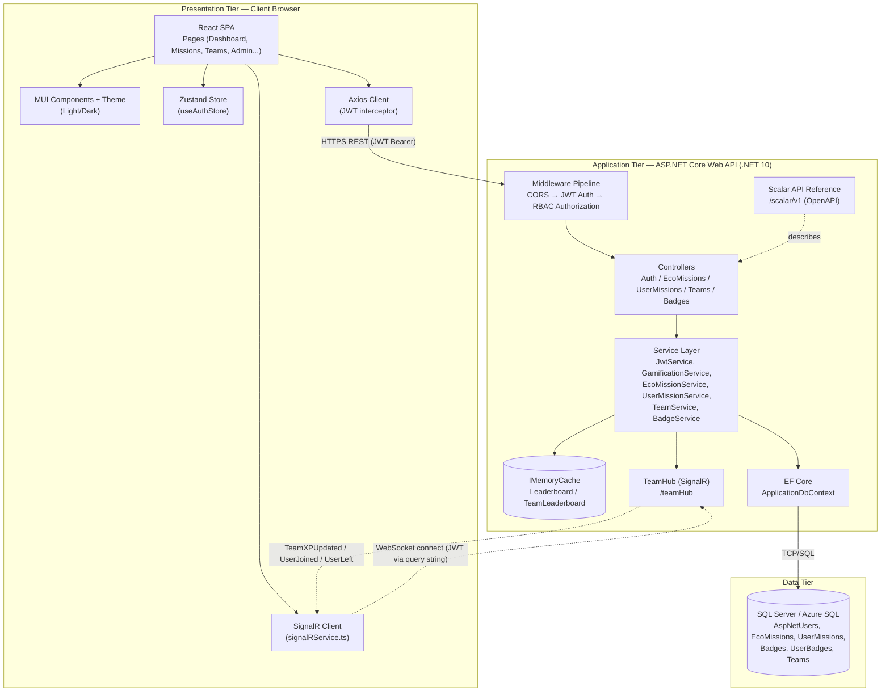
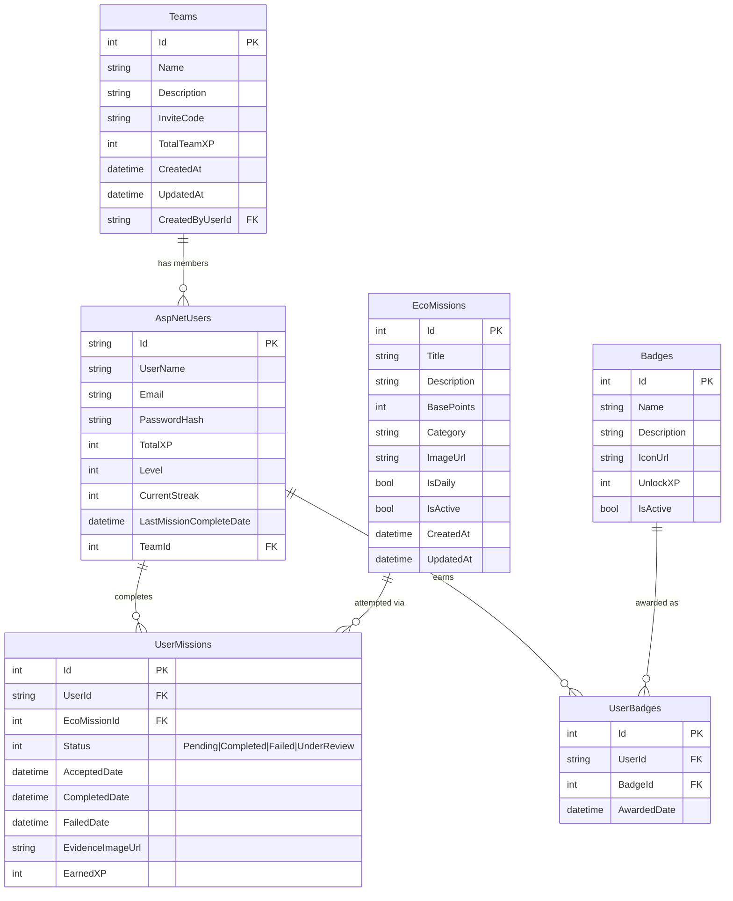
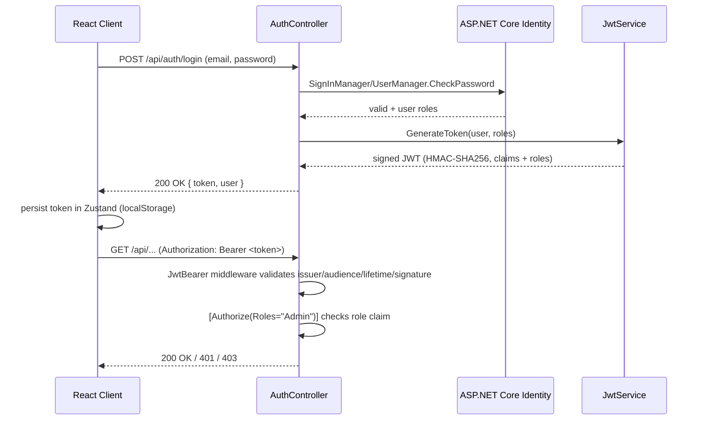
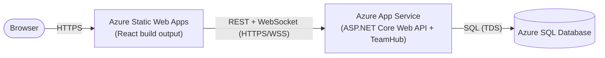

# System Architecture — Kaitiaki Quest

## 1. Overview

Kaitiaki Quest is a full-stack, gamified conservation application built as a classic **3-tier client-server architecture**:

1. **Presentation Tier** — React 19 + TypeScript single-page application (MUI, Zustand, Axios, SignalR client)
2. **Application Tier** — ASP.NET Core (.NET 10) Web API (Controllers → Services → EF Core), plus a SignalR hub for real-time push
3. **Data Tier** — SQL Server (Azure SQL in production, LocalDB in development), accessed exclusively through Entity Framework Core

The tiers communicate over HTTPS: standard request/response for CRUD operations, and a persistent WebSocket connection (SignalR, auto-falling back to Server-Sent Events / Long Polling) for real-time team XP updates.

### 1.1 Architecture Diagram



---

## 2. Technology Stack

| Layer | Technology | Version |
| :--- | :--- | :--- |
| **Frontend** | React + TypeScript | 19.x / 5.x |
| UI Library | MUI (Material-UI) | 9.x |
| State Management | Zustand | 5.x |
| HTTP Client | Axios | 1.x |
| Real-time Client | @microsoft/signalr | 10.x |
| Build Tool | Vite | 8.x |
| Testing | Vitest + React Testing Library + MSW | 4.x |
| **Backend** | ASP.NET Core Web API | .NET 10.0 |
| ORM | Entity Framework Core | 10.0 |
| Identity / Auth | ASP.NET Core Identity + JWT Bearer | 10.0 |
| Real-time Server | SignalR | 10.0 |
| Caching | IMemoryCache (in-process) | 10.0 |
| API Docs | Scalar (`Scalar.AspNetCore`) over OpenAPI | 2.x |
| Testing | xUnit + Moq + FluentAssertions + EF Core InMemory | — |
| **Database** | SQL Server (Azure SQL in prod, LocalDB in dev) | 2022 |
| **Deployment** | Azure Static Web Apps (frontend) + Azure App Service (backend) | — |

---

## 3. Backend Structure (.NET 10 Web API)

The backend follows a layered **Controller → Service → EF Core DbContext** design — no repository abstraction is added on top of `DbContext`, since it already implements the Unit of Work / Repository patterns natively.

```
backend/KaitiakiQuest.API/
├── Controllers/            # Thin HTTP layer — model binding, [Authorize] policies, calls Services
│   ├── AuthController.cs           # register / login / me
│   ├── EcoMissionsController.cs    # mission library CRUD (Admin-gated writes)
│   ├── UserMissionsController.cs   # accept / complete / abandon missions, leaderboard
│   ├── TeamsController.cs          # create / join / leave, team leaderboard
│   └── BadgesController.cs         # badge catalogue + my-badges
├── Services/
│   ├── Interfaces/                 # IEcoMissionService, IUserMissionService, ITeamService,
│   │                                # IBadgeService, IJwtService, IGamificationService
│   ├── Implementations/            # Business logic, EF Core queries, cache + SignalR calls
│   └── ServiceResult.cs            # Generic Success/Fail envelope returned by every service method
├── Hubs/
│   └── TeamHub.cs                  # [Authorize] SignalR hub — auto-joins caller's team group
├── Models/                         # EF Core entities (ApplicationUser, EcoMission, UserMission,
│                                    # Badge, UserBadge, Team)
├── DTOs/                           # Request/response contracts (ApiResponse<T>, AuthDtos, ...)
├── Data/
│   ├── ApplicationDbContext.cs     # IdentityDbContext<ApplicationUser>
│   └── SeedData.cs                 # Seeds Admin/User roles + demo accounts + sample missions
├── Migrations/                     # EF Core code-first migrations
└── Program.cs                      # DI container, JWT/CORS/SignalR/Cache/Scalar wiring
```

**Request pipeline** (`Program.cs`): CORS → HTTPS redirection → `UseAuthentication` (JWT Bearer) → `UseAuthorization` (RBAC) → `MapControllers` / `MapHub<TeamHub>("/teamHub")`.

Every controller action returns a consistent `ApiResponse<T>` envelope:

```json
{
  "success": true,
  "message": "Operation successful",
  "data": { "...": "..." },
  "errors": null
}
```

### 3.1 Key Endpoints

| Controller | Endpoints | Auth |
| :--- | :--- | :--- |
| **Auth** | `POST /api/auth/register`, `POST /api/auth/login`, `GET /api/auth/me` | Anonymous / JWT |
| **EcoMissions** | `GET /`, `GET /{id}`, `GET /categories`, `POST /`, `PUT /{id}`, `DELETE /{id}` | JWT / **Admin** for writes |
| **UserMissions** | `GET /my-missions`, `GET /stats`, `POST /accept`, `PUT /{id}/complete`, `DELETE /{id}`, `GET /leaderboard` | JWT |
| **Teams** | `GET /my-team`, `GET /{teamId}`, `POST /`, `POST /join`, `POST /leave`, `GET /leaderboard` | JWT |
| **Badges** | `GET /`, `GET /my-badges` | JWT |

---

## 4. Frontend Structure (React + TypeScript)

```
frontend/src/
├── main.tsx                         # Entry point — mounts <App /> into #root
├── App.tsx                          # Composition root: ThemeProvider > SnackbarProvider > RouterProvider
├── api/
│   ├── client.ts                    # Axios instance — request interceptor attaches JWT from
│   │                                #   localStorage("auth-storage"); response interceptor handles
│   │                                #   401 (redirect to /login) and toasts errors via notistack
│   ├── missionApi.ts                # Covers BOTH EcoMissions (catalog CRUD, /api/ecomissions) and
│   │                                #   UserMissions (accept/complete/abandon/leaderboard/stats,
│   │                                #   /api/usermissions) — one module for the whole missions domain
│   ├── teamApi.ts                   # /api/teams (create/join/leave/my-team/leaderboard)
│   ├── badgeApi.ts                  # /api/badges (catalogue + my-badges)
│   └── __tests__/
│       └── client.test.ts
├── assets/                          # (empty — no static assets checked in yet)
├── components/
│   ├── common/
│   │   ├── ProtectedRoute.tsx       # Auth-only guard — redirects to /login if not authenticated
│   │   │                           #   (no role check; does NOT gate /admin)
│   │   └── __tests__/
│   │       └── ProtectedRoute.test.tsx
│   ├── layout/
│   │   └── MainLayout.tsx           # App shell: AppBar/nav, theme toggle, user menu, <Outlet/>;
│   │                               #   also owns the global SignalR connection lifecycle (see below)
│   └── missions/
│       ├── MissionCard.tsx
│       ├── MissionDetailDialog.tsx
│       ├── StatsCard.tsx
│       └── __test__/
│           └── MissionCard.test.tsx
├── pages/                           # One folder per route; most (not all) have a colocated tests folder
│   ├── Login/
│   │   └── Login.tsx                # Public route, outside MainLayout — no test folder yet
│   ├── Register/
│   │   └── Register.tsx             # Public route, outside MainLayout — no test folder yet
│   ├── Dashboard/
│   │   ├── Dashboard.tsx            # XP, level, streak, stats overview
│   │   └── __tests__/
│   │       └── Dashboard.test.tsx
│   ├── MyMissions/
│   │   ├── MyMissions.tsx           # Accept / complete / abandon missions
│   │   └── __tests__/
│   │       └── MyMissions.test.tsx
│   ├── Teams/
│   │   ├── Teams.tsx                # Create/join/leave team, live team XP
│   │   └── __tests__/
│   │       └── Teams.test.tsx
│   ├── Leaderboard/
│   │   ├── Leaderboard.tsx          # Personal + team leaderboards
│   │   └── __tests__/
│   │       └── Leaderboard.tests.tsx
│   ├── Profile/
│   │   ├── Profile.tsx              # Stats, badges, level progress
│   │   └── __tests__/
│   │       └── Profile.test.tsx
│   └── Admin/
│       └── AdminPanel.tsx           # Mission CRUD — route reachable by any authenticated user,
│                                    #   but self-guards: renders "access denied" when user.roles
│                                    #   doesn't include "Admin" (nav link is also hidden); no test folder yet
├── router/
│   └── index.tsx                    # createBrowserRouter table: /login, /register public; "/" wrapped
│                                    #   in <ProtectedRoute><MainLayout/></ProtectedRoute> with dashboard/
│                                    #   my-missions/teams/leaderboard/profile/admin as nested children
├── store/
│   ├── useAuthStore.ts              # Zustand store — user, token, isAuthenticated, isLoading;
│                                    #   persisted to localStorage under the "auth-storage" key
│   └── useAuthStore.test.ts
├── services/
│   └── signalRService.ts            # Singleton wrapping HubConnectionBuilder — connects with the JWT
│                                    #   as accessTokenFactory, registers TeamXPUpdated/UserJoined/
│                                    #   UserLeft handlers that show a toast and re-dispatch as window
│                                    #   CustomEvents for pages to listen to (no client-side group
│                                    #   join/leave — the server auto-assigns the group in TeamHub)
├── theme/
│   ├── ThemeContext.tsx             # React context holding the current mode + toggle function
│   ├── ThemeProvider.tsx            # MUI ThemeProvider wired to ThemeContext (light/dark)
│   ├── theme.ts                     # MUI theme definitions (palette, typography, etc.)
│   └── useTheme.ts                  # useThemeContext() hook consumed by MainLayout's toggle button
├── types/
│   ├── api.ts                       # ApiResponse<T> envelope type
│   ├── auth.ts
│   ├── axios.d.ts
│   ├── badge.ts
│   ├── mission.ts
│   └── team.ts
├── test/
│   └── setup.ts                     # Vitest/RTL global test setup
└── utils/
    ├── badgeIcons.ts
    └── handleApiErrorMsg.ts
```

**Data flow**: Pages call `api/*` modules → Axios attaches the JWT from `useAuthStore`'s persisted state → API responses update Zustand/local component state. Independently, `MainLayout` opens one SignalR connection for the whole app the moment a user authenticates (and tears it down on logout); `signalRService` turns incoming hub events into `window` `CustomEvent`s (`teamXPUpdated`, `teamMemberJoined`, `teamMemberLeft`) plus toast notifications, which interested pages (e.g. `Teams`) subscribe to directly — this path is independent of the REST request/response cycle.

---

## 5. Database Schema (SQL Server / EF Core Code-First)

### 5.1 Entity-Relationship Diagram



### 5.2 Notes

- `AspNetUsers` is `ApplicationUser : IdentityUser`, extended with gamification fields (`TotalXP`, `Level`, `CurrentStreak`, `LastMissionCompleteDate`) and a nullable one-to-many `TeamId` FK to `Teams` (a user belongs to at most one team).
- Roles (`Admin`, `User`) live in the standard Identity tables (`AspNetRoles`, `AspNetUserRoles`), seeded by `SeedData.cs`.
- `Teams.InviteCode` doubles as the SignalR **group name** — joining a team is what determines which group a hub connection is added to.
- All foreign keys use `[ForeignKey]` data annotations; migrations are managed with `dotnet ef migrations` (see `Migrations/`).

---

## 6. Security Architecture: JWT + RBAC

### 6.1 Authentication Flow



- **Token contents**: `NameIdentifier` (user id), `Email`, `Name`, `TotalXP`, `Level`, and one `role` claim per assigned role — issued by `JwtService.GenerateToken`.
- **Signing**: symmetric HMAC-SHA256 key from `Jwt:Key`; validated against `Jwt:Issuer` / `Jwt:Audience` with `ValidateLifetime = true`.
- **Expiry**: configurable via `Jwt:ExpiryMinutes` (default 1440 minutes / 24 hours).
- **SignalR-specific handling**: browsers can't set custom headers on the WebSocket handshake, so `JwtBearerEvents.OnMessageReceived` extracts the token from the `access_token` query string, but **only** for requests to the `/teamHub` path — REST calls still require the standard `Authorization: Bearer` header.

### 6.2 Role-Based Access Control (RBAC)

| Role | Permissions |
| :--- | :--- |
| **User** | Register/login, accept/complete/abandon missions, view leaderboard, create/join/leave a team, view badges/profile |
| **Admin** | All `User` permissions + create/update/delete entries in the `EcoMissions` library |

- Enforced declaratively with `[Authorize]` (any authenticated user) and `[Authorize(Roles = "Admin")]` (write endpoints on `EcoMissionsController`).
- On the frontend, `ProtectedRoute` only checks *authentication* (redirects anonymous users to `/login`); the `/admin` route itself is reachable by any logged-in user, but `AdminPanel.tsx` reads `user.roles` from the auth store and renders an "access denied" view (and hides the nav link) for non-admins. Either way, this is UX convenience only — the **`[Authorize(Roles = "Admin")]` attribute on the API is the actual security boundary**, since a non-admin could still call the write endpoints directly with their own valid JWT if the server didn't enforce it.
- Passwords are hashed by ASP.NET Core Identity (PBKDF2); no plaintext credential ever touches the database.

---

## 7. Advanced Feature #1 — Real-Time Communication (SignalR)

| Component | Responsibility |
| :--- | :--- |
| `TeamHub` (`/teamHub`) | `[Authorize]`-protected hub. On `OnConnectedAsync`, reads the caller's `NameIdentifier` claim, looks up their `Team`, and auto-joins the SignalR group named after the team's `InviteCode` — clients never call an explicit "join room" method. |
| `IHubContext<TeamHub>` (injected into `UserMissionService` / `TeamService`) | Used from regular HTTP request handling to push events to a team's group after a DB write completes. |
| `TeamXPUpdated` | Broadcast by `UserMissionService` after a mission completion changes `Team.TotalTeamXP`. |
| `UserJoined` / `UserLeft` | Broadcast by `TeamService` on team join/leave. |
| Sender exclusion | Broadcasts use `Clients.GroupExcept(room, [callerConnectionId])` when the caller's own connection ID is known, so the acting client updates via the HTTP response instead of double-processing its own event. |

Transport negotiation is handled automatically by the SignalR client (WebSocket → Server-Sent Events → Long Polling), and the JWT is passed via query string as described in §6.1.

---

## 8. Advanced Feature #2 — Caching Strategy (IMemoryCache)

| Cache Key | Populated By | Data | TTL | Invalidated On |
| :--- | :--- | :--- | :--- | :--- |
| `Leaderboard` | `UserMissionService.GetLeaderboardAsync` | Top users ranked by `TotalXP` | 5 minutes (sliding/absolute via `MemoryCacheEntryOptions`) | Mission completion (`UserMissionService`) |
| `TeamLeaderboard` | `TeamService.GetTeamLeaderboardAsync` | Teams ranked by `TotalTeamXP` | 5 minutes | Team XP change, team join/leave, team create/delete (`TeamService`, `UserMissionService`) |

- Registered once in `Program.cs` via `builder.Services.AddMemoryCache()` — a single in-process cache, appropriate for the current single-instance App Service deployment (would need a distributed cache like Redis if scaled out horizontally).
- Read path: `_cache.TryGetValue(key, out cached)` short-circuits the EF Core query and returns cached data directly.
- Write path: every mutation that affects XP/team totals explicitly calls `_cache.Remove(key)` immediately after the DB write commits, trading a small "cache stampede on next read" cost for strong-enough read-after-write consistency on leaderboards.
- **Measured impact**: leaderboard endpoint latency drops from ~200ms (cold, DB aggregation query) to <10ms (cache hit).

---

## 9. Advanced Feature #3 — API Documentation (Scalar)

- The backend uses the built-in **Microsoft.AspNetCore.OpenApi** generator (`builder.Services.AddOpenApi()` / `app.MapOpenApi()`) to produce the OpenAPI document, and **Scalar.AspNetCore** (`app.MapScalarApiReference()`) to render it as an interactive reference UI at `/scalar/v1` — used in place of the classic Swagger UI.
- Every controller action's request/response DTOs, route, HTTP verb, and `[Authorize]` requirement are reflected automatically, giving the frontend team and API consumers a live, always-in-sync contract without hand-maintained docs.
- Locally available at `https://localhost:7225/scalar/v1` once the backend is running (see `README.md`).

---

## 10. Key Design Decisions

| Decision | Rationale |
| :--- | :--- |
| JWT over cookie sessions | Stateless, SPA-friendly, avoids server-side session storage and CSRF concerns |
| Service layer calls EF Core `DbContext` directly | `DbContext` already implements Unit of Work/Repository; an extra repository layer would be pure indirection |
| `IMemoryCache` over a distributed cache | Sufficient for the current single-instance Azure App Service deployment; simplest option that meets the <200ms NFR |
| SignalR group = Team InviteCode | Reuses an existing unique identifier as the room name instead of introducing a separate room-mapping table |
| Zustand over Redux | Minimal boilerplate for a small, mostly-flat client state (auth/session) |
| EF Core InMemory provider for the `Testing` environment | Fast, isolated integration tests with no external SQL Server dependency (see `Program.cs` environment branch) |
| Scalar over Swagger UI | Required by the MSA brief; also gives a more modern try-it-out experience over the same OpenAPI document |

---

## 11. Deployment Architecture



**Backend configuration** (Azure App Service → Configuration):
```
ASPNETCORE_ENVIRONMENT=Production
ConnectionStrings__DefaultConnection=<Azure SQL connection string>
Jwt__Key=<production secret>
Jwt__Issuer=KaitiakiQuestAPI
Jwt__Audience=KaitiakiQuestFrontend
Jwt__ExpiryMinutes=1440
Cors__AllowedOrigins__0=<Static Web Apps origin>
```

**Frontend configuration** (Azure Static Web Apps → Environment Variables):
```
VITE_API_BASE_URL=https://<api-app-name>.azurewebsites.net
```
